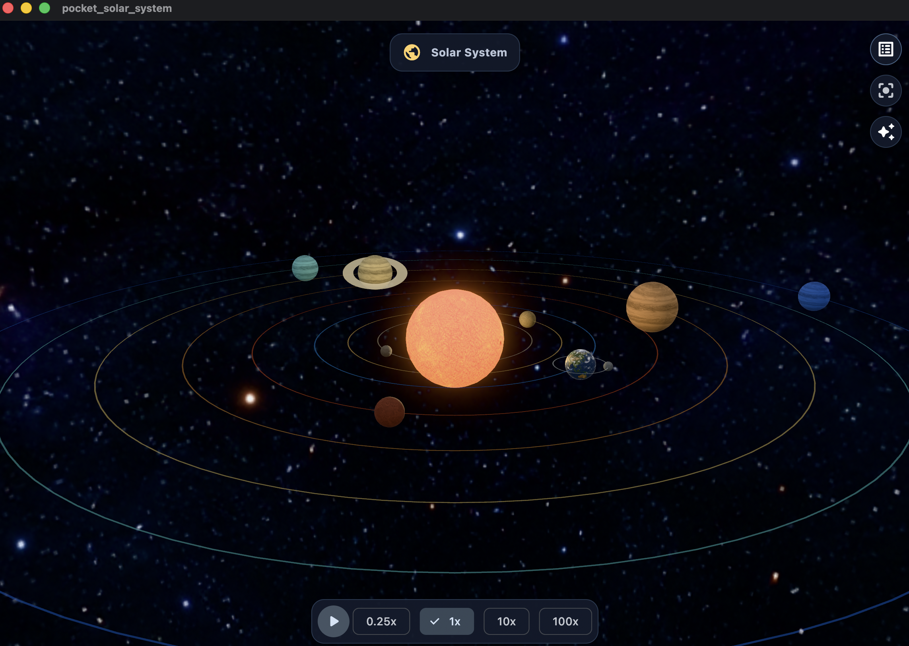
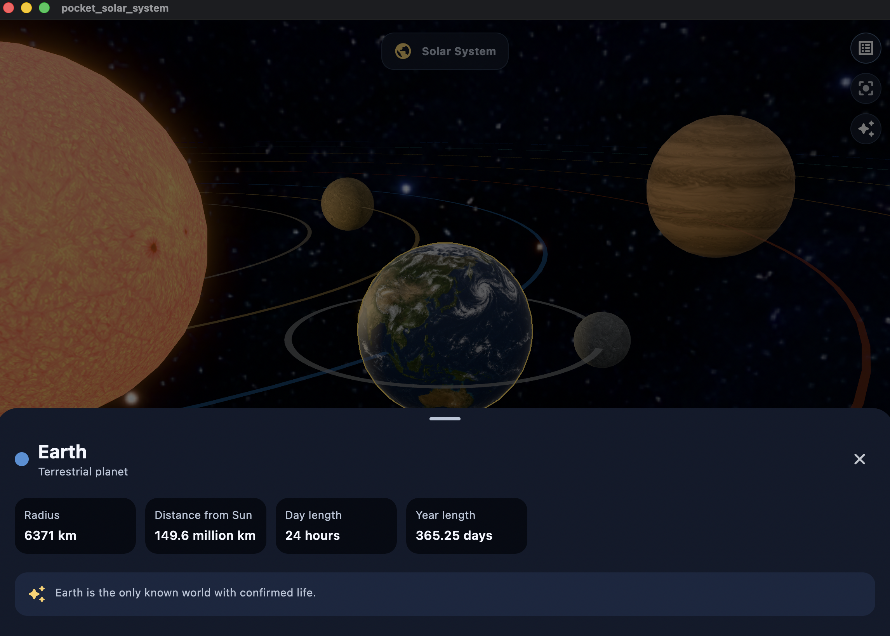

 # Pocket Solar System

A small interactive 3D Solar System built with Flutter. This project is primarily a hands-on learning environment for [`flutter_scene`](https://pub.dev/packages/flutter_scene): it explores a scene graph, physically based materials, textured geometry, camera input, and mobile-oriented rendering choices without the overhead of a full game engine.

> This is an educational sample. Orbital distances, planet sizes, and speeds are intentionally adjusted for readability on a phone screen rather than astronomical scale.

## Screenshots

| Overview | Earth detail |
| --- | --- |
|  |  |

## Features

- Interactive 3D scene containing the Sun, eight planets, and the Moon.
- Hierarchical orbits, including the Moon orbiting Earth.
- Equirectangular surface textures, a deep-space starfield, PBR materials, bloom, and a point light representing the Sun.
- Dedicated, realistic Earth texture with oceans, continents, ice caps, and cloud systems.
- Orbit/pinch camera interaction, selectable bodies, contextual body details, and simulation speed controls.
- First-run gesture tutorial stored locally with `shared_preferences`.
- Accessible alternatives to direct 3D interaction: semantic labels, live loading/error announcements, and a body-selection menu.
- Balanced and performance rendering profiles.

## Technology stack

| Technology | Purpose |
| --- | --- |
| Flutter / Dart | Cross-platform application framework and UI layer. |
| [`flutter_scene`](https://pub.dev/packages/flutter_scene) | 3D scene graph, geometry, materials, lighting, camera controls, and rendering. |
| [`vector_math`](https://pub.dev/packages/vector_math) | Vectors, quaternions, bounds, and orbital transforms. |
| [`shared_preferences`](https://pub.dev/packages/shared_preferences) | Persists the first-run tutorial acknowledgement. |
| Flutter GPU | GPU-backed Flutter rendering, enabled for the supported targets in this project. |

## Architecture

The codebase uses a lightweight feature-first structure:

```text
lib/
├── design_system/                 # Theme, color tokens, layout constants
└── features/solar_system/
    ├── application/               # Simulation, camera, and quality controllers
    ├── data/                      # Celestial body definitions and color palette
    ├── domain/                    # Body, surface, ID, and information models
    ├── rendering/                 # Texture catalog and color conversion
    └── widgets/                   # Scene, controls, tutorial, details, accessibility UI
```

`SolarSystemSceneWidget` owns the `flutter_scene` scene graph. It loads assets once, creates a node for each body, attaches orbital nodes to their parent nodes, and updates each transform from `SimulationController` on every render tick. UI widgets communicate through small `ChangeNotifier` controllers instead of reaching into the scene directly.

## Rendering notes

- Planet surfaces use `SphereGeometry` and equirectangular 2:1 textures.
- Generic rocky/gaseous textures are color-tinted through a material factor; Earth keeps its full-color texture to preserve natural surface detail.
- The starfield is rendered on a large, double-sided sphere around the camera using an unlit material.
- The Sun is emissive and also supplies a `PointLight` for the other bodies.
- The performance profile disables bloom while keeping the scene graph and interaction model unchanged.

## Requirements

- Flutter SDK compatible with the version declared in `pubspec.yaml`.
- A macOS, iOS, Android, or web target supported by Flutter and `flutter_scene`.
- For a physical iOS device, a valid Apple Developer signing team and provisioning profile.

## Run locally

Install dependencies and start the default target:

```bash
flutter pub get
flutter run
```

Run on macOS with Flutter GPU and profile optimizations:

```bash
flutter run --profile --enable-flutter-gpu -d macos
```

List available devices:

```bash
flutter devices
```

## Quality checks

```bash
flutter analyze
flutter test
```

The test suite covers the virtual clock, pause behavior, camera focus requests, rendering-profile selection, first-run tutorial persistence, accessible body selection, and orbital hierarchy validation.

## Mobile performance measurement

Measure on a physical device in profile mode, not an emulator:

```bash
flutter run --profile --enable-flutter-gpu -d <device-id>
```

In Flutter DevTools **Performance**, capture at least 30 seconds for each scenario:

1. Overview at `1x` simulation speed.
2. Earth focused at `100x` simulation speed.
3. Continuous camera orbiting and pinch-zoom for 15 seconds.
4. The same scenarios using the **Performance** rendering profile.

Record average FPS, UI/raster frame-time percentiles, peak memory, and device temperature/battery impact. Target 60 FPS on typical devices (or 30 FPS on entry-level hardware), with no sustained jank or unbounded memory growth.
